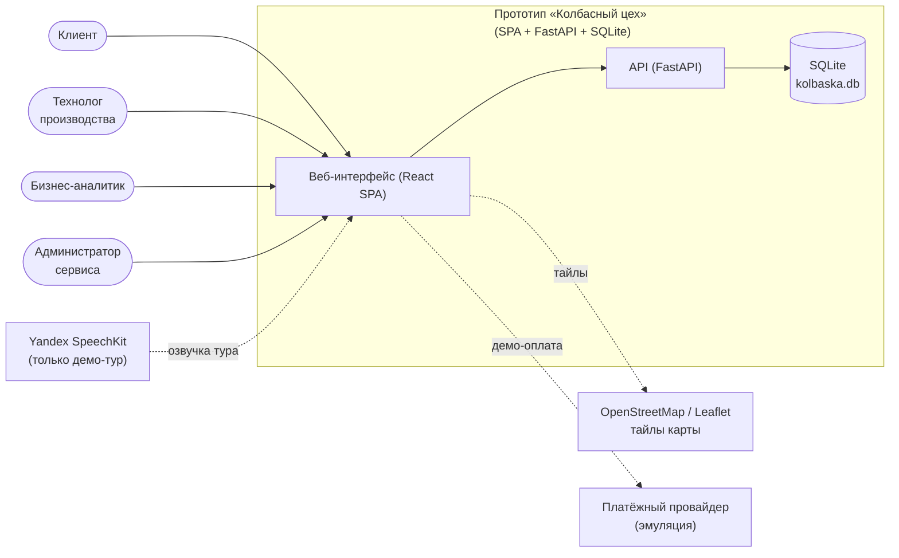
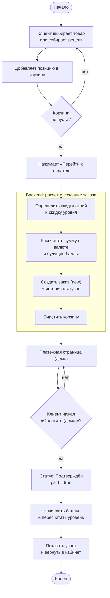
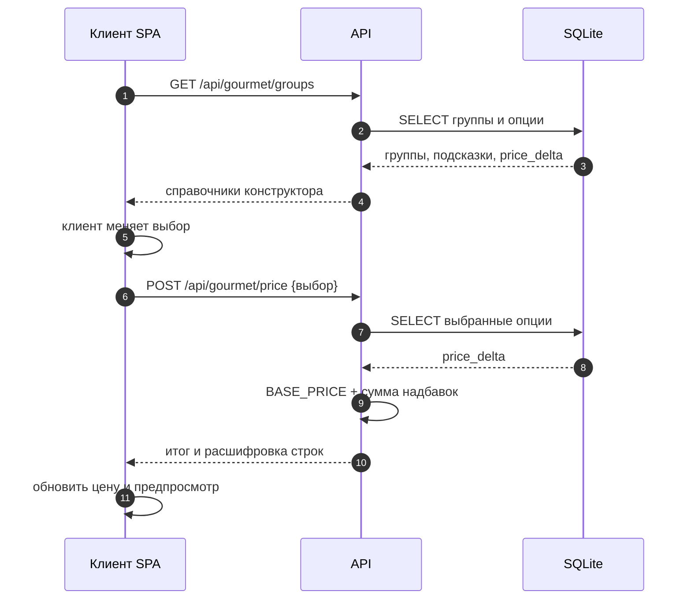
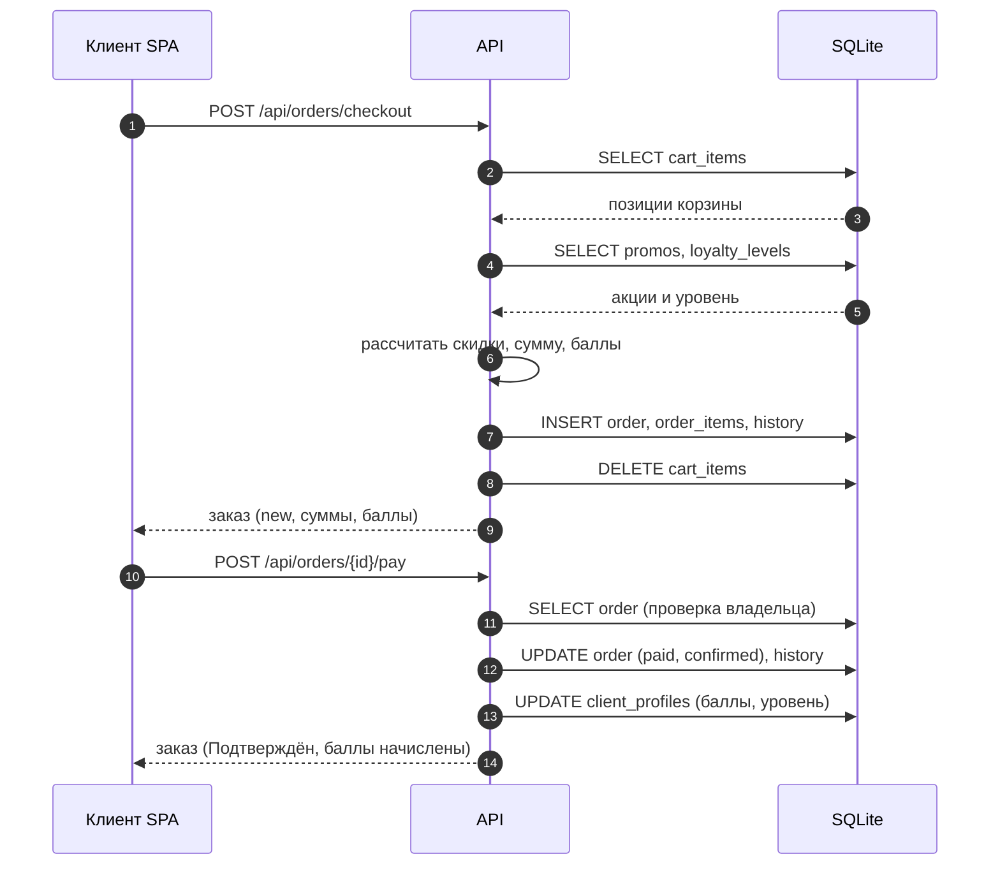
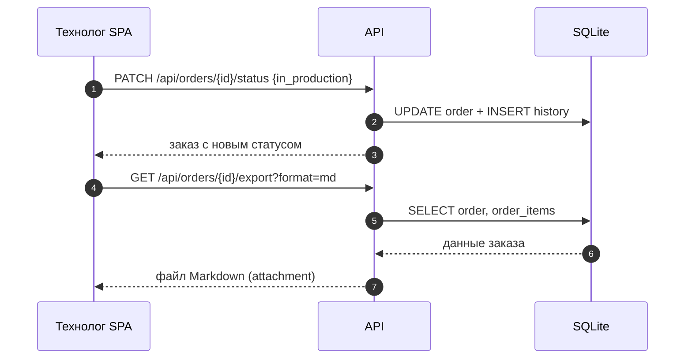
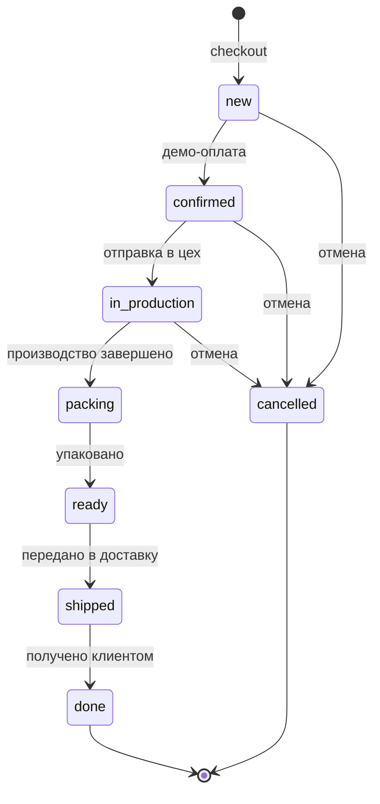

# Процессы и последовательности

Артефакт системного аналитика: контекстная диаграмма, бизнес-процесс оформления заказа,
диаграммы последовательности ключевых операций и жизненный цикл заказа.

Связанные артефакты: `docs/analysis/use-cases.md`, `docs/analysis/requirements.md`,
`docs/specification.md` (ER-диаграмма и API).

## 1. Контекстная диаграмма (C4, уровень 1)

## 2. Бизнес-процесс «Оформление и оплата заказа»

## 3. Последовательность: расчёт цены изделия по рецепту

## 4. Последовательность: оформление и демо-оплата

## 5. Последовательность: выгрузка заказа технологом

## 6. Жизненный цикл заказа

> В прототипе переходы выполняются вручную технологом/администратором; автоматических триггеров и
> интеграции с производством нет.
