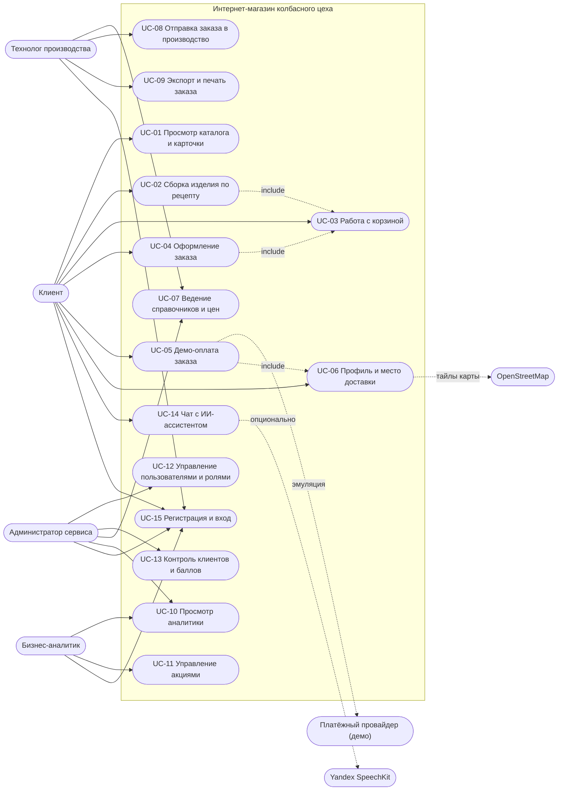

# Варианты использования (Use Cases)

Артефакт системного аналитика: диаграмма вариантов использования, акторы, каталог сценариев с
предусловиями, основным и альтернативными потоками, постусловиями.

Связанные артефакты: `docs/analysis/requirements.md` (требования и трассируемость),
`docs/analysis/processes.md` (диаграммы процессов), `docs/analysis/glossary.md` (глоссарий).

## 1. Диаграмма вариантов использования

## 2. Каталог сценариев

| UC | Название | Актор | Приоритет |
| --- | --- | --- | --- |
| UC-01 | Просмотр каталога и карточки товара | Клиент | M |
| UC-02 | Сборка изделия по рецепту | Клиент | M |
| UC-03 | Работа с корзиной | Клиент | M |
| UC-04 | Оформление заказа | Клиент | M |
| UC-05 | Демо-оплата заказа | Клиент | M |
| UC-06 | Профиль и место доставки | Клиент | M |
| UC-07 | Ведение справочников и цен | Технолог | M |
| UC-08 | Отправка заказа в производство | Технолог | M |
| UC-09 | Экспорт и печать заказа | Технолог | M |
| UC-10 | Просмотр аналитики | Аналитик | M |
| UC-11 | Управление акциями | Аналитик | M |
| UC-12 | Управление пользователями и ролями | Администратор | M |
| UC-13 | Контроль клиентов и баллов | Администратор | M |
| UC-14 | Чат с ИИ-ассистентом | Клиент/гость | S |
| UC-15 | Регистрация и вход | Все | M |

## 3. Описания ключевых сценариев

### UC-04. Оформление заказа

- **Актор:** Клиент. **Предусловия:** вход выполнен, в корзине ≥ 1 позиция.
- **Триггер:** нажатие «Перейти к оплате».
- **Основной поток:**
  1. Система читает позиции корзины.
  2. Для каждой позиции определяется применимая скидка акции.
  3. К подытогу применяется скидка уровня лояльности.
  4. Рассчитывается сумма в валюте заказа и будущие баллы.
  5. Создаётся заказ (`new`) с позициями, история статусов пополняется, корзина очищается.
  6. Система переводит клиента на платёжную страницу.
- **Альтернативы:** корзина пуста → ошибка 400 и возврат в корзину; нет активной акции → скидка 0.
- **Постусловия:** заказ существует в статусе `new`, корзина пуста.
- **Реализация:** `POST /api/orders/checkout`, `services.resolve_discount`, `services.points_multiplier`.

### UC-05. Демо-оплата заказа

- **Актор:** Клиент. **Предусловия:** заказ принадлежит клиенту и не оплачен.
- **Основной поток:**
  1. Клиент открывает платёжную страницу (демонстрационную).
  2. Нажимает «Оплатить (демо)».
  3. Заказ помечается оплаченным, статус → «Подтверждён».
  4. Начисляются баллы, пересчитывается уровень, добавляется запись в историю.
- **Альтернативы:** повторная оплата → без повторного начисления (см. раздел «Известные ограничения»).
- **Постусловия:** `paid = true`, статус `confirmed`, баллы начислены.
- **Реализация:** `POST /api/orders/{id}/pay`.

### UC-02. Сборка изделия по рецепту

- **Актор:** Клиент. **Предусловия:** открыт раздел «Для мясоедов-гурманов».
- **Основной поток:**
  1. Клиент последовательно выбирает: тип изделия, технологию, сырьё, добавки, специи, форму.
  2. При каждом изменении система пересчитывает цену и обновляет подсказки/предпросмотр.
  3. Клиент сохраняет конфигурацию и добавляет её в корзину.
- **Альтернативы:** не выбраны обязательные шаги → добавление блокируется с подсказкой.
- **Постусловия:** создана запись `custom_configs`, позиция добавлена в корзину.
- **Реализация:** `GET /api/gourmet/groups`, `POST /api/gourmet/price`, `POST /api/gourmet/configs`, `POST /api/cart/items`.

### UC-08. Отправка заказа в производство

- **Актор:** Технолог. **Предусловия:** вход с ролью технолога/администратора, существует заказ.
- **Основной поток:**
  1. Технолог открывает список заказов и выбирает заказ.
  2. Нажимает «Отправить в производство».
  3. Статус меняется на `in_production`, добавляется запись в историю.
- **Альтернативы:** недопустимый статус → ошибка 400.
- **Постусловия:** статус и история обновлены.
- **Реализация:** `PATCH /api/orders/{id}/status`.
- **Примечание:** реальная передача в АСУ не выполняется — эмуляция.

### UC-09. Экспорт и печать заказа

- **Актор:** Технолог. **Предусловия:** заказ существует.
- **Основной поток:**
  1. Технолог выбирает формат (Markdown/JSON) или печать.
  2. Система формирует документ и отдаёт его на скачивание/печать.
- **Постусловия:** файл сформирован, данные заказа не изменены.
- **Реализация:** `GET /api/orders/{id}/export?format=md|json`, печать на странице технолога.

### UC-11. Управление акциями

- **Актор:** Аналитик. **Предусловия:** вход с ролью аналитика/администратора.
- **Основной поток:**
  1. Аналитик создаёт акцию: тип (скидка/множитель баллов), охват (товар/категория/все), значение, период.
  2. Система сохраняет и делает акцию активной.
  3. Акция применяется при оформлении заказов и отображается клиенту.
- **Альтернативы:** некорректный период → акция не применяется.
- **Постусловия:** акция доступна в `/api/promos/public`.
- **Реализация:** `POST/PUT/DELETE /api/promos`.

### UC-12. Управление пользователями и ролями

- **Актор:** Администратор. **Предусловия:** вход с ролью администратора.
- **Основной поток:**
  1. Администратор создаёт пользователя или меняет роль существующего.
  2. При необходимости блокирует/разблокирует аккаунт или сбрасывает пароль.
- **Постусловия:** изменённые права действуют при следующем запросе (роль проверяется на сервере).
- **Реализация:** `POST /api/admin/users`, `PATCH /api/admin/users/{id}`.

## 4. Известные ограничения сценариев (для аналитика)

- UC-05: повторный вызов оплаты не должен начислять баллы дважды — требуется идемпотентность
  (в прототипе не реализовано, вынесено как рекомендация).
- UC-08: интеграция с производственной системой отсутствует (эмуляция статусов).
- UC-06: координаты сохраняются, но не влияют на стоимость и маршрут доставки.
