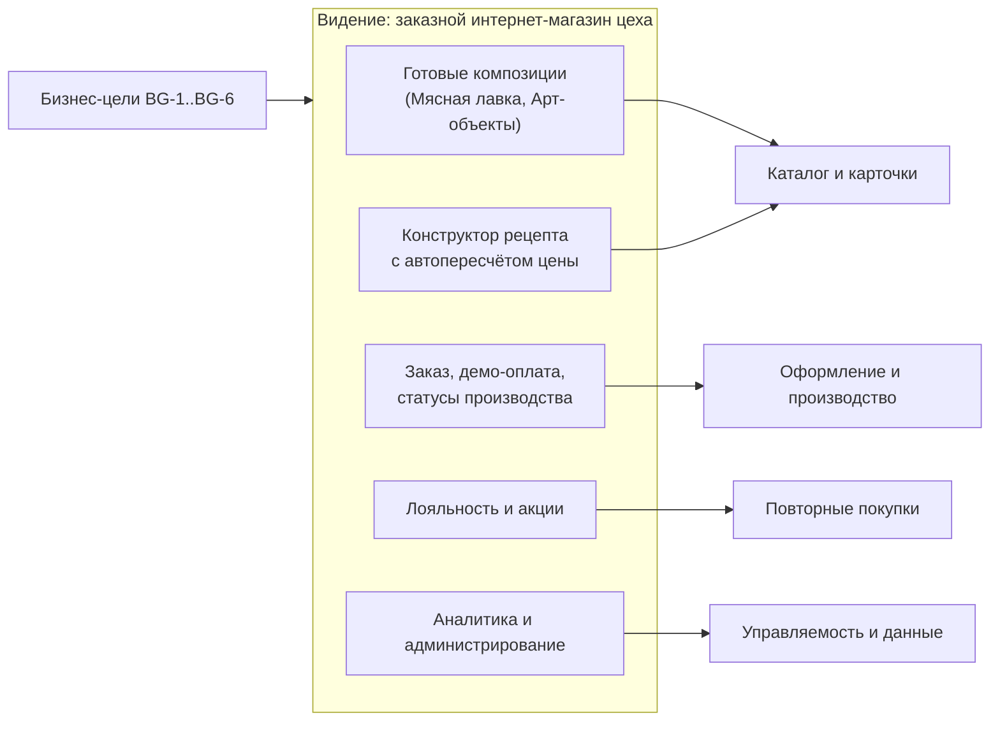

# Vision & Scope (видение продукта и границы)

Первый артефакт системного аналитика: зачем создаётся продукт, для кого, что даёт бизнесу, что входит
и не входит в объём, как измеряется успех.

Связанные артефакты: `docs/analysis/requirements.md`, `docs/analysis/use-cases.md`,
`docs/analysis/processes.md`, `docs/analysis/glossary.md`, `docs/specification.md`.

## 1. Проблема и контекст

Крупный мясокомбинат открывает **новый цех заказного производства**. Существующие каналы продаж
(магазины, маркетплейсы) работают с массовой продукцией и не поддерживают:

- продажу **художественных «колбасных тортов»** и арт-объектов с указанием состава, веса, габаритов,
  стоимости и срока производства;
- приём **заказов по индивидуальному рецепту** клиента малыми объёмами с выбором технологии;
- программу лояльности, временные акции и роли технолога/аналитика/администратора.

## 2. Цели бизнеса

| ID | Цель | Метрика достижения |
| --- | --- | --- |
| BG-1 | Запустить приём заказов на заказные изделия | каталог, корзина, оформление и оплата работают end-to-end |
| BG-2 | Повысить средний чек за счёт премиальных позиций | доля «Арт-объектов» и рецептов в заказах |
| BG-3 | Удержать клиентов программой лояльности | повторные заказы, распределение по уровням |
| BG-4 | Дать технологу управление производством заказов | доля заказов, переведённых в «В производстве» через систему |
| BG-5 | Обеспечить аналитику продаж и акций | наличие дашбордов и оценки эффекта акций |
| BG-6 | Снизить зависимость от ручных каналов | доля заказов, оформленных в системе |

## 3. Видение продукта

**Vision statement.**
Для клиентов мясокомбината, которые хотят необычный мясной подарок или изделие по своему рецепту,
«Колбасный цех» — интернет-магазин заказного производства, который позволяет собрать изделие,
увидеть его состав, вес, габариты и цену, оформить заказ и получать баллы. В отличие от обычных
магазинов, продукт соединяет готовые авторские композиции и конструктор рецепта с прозрачной ценой.

**Elevator pitch.**
«Колбасные торты и изделия по вашему рецепту — от цеха мясокомбината, с онлайн-конструктором,
лояльностью и акциями».

**Ценность по ролям.**

| Роль | Ценность |
| --- | --- |
| Клиент | выбор готовой композиции или сборка своего рецепта, прозрачная цена и срок, баллы и скидки |
| Технолог | единый интерфейс справочников, цен и заказов, выгрузка задания в цех |
| Аналитик | данные о продажах и инструменты управления акциями |
| Администратор | управление доступами и клиентской базой |

## 4. Целевые пользователи

| Персона | Потребность | Ключевые сценарии |
| --- | --- | --- |
| Клиент-«подарок» | эффектный подарок к празднику | каталог → карточка → корзина → оплата |
| Клиент-«гурман» | изделие по своему вкусу | конструктор → цена → заказ |
| Технолог | быстро передать заказ в цех | заказы → статус → выгрузка MD/JSON |
| Аналитик | понять, что продаётся и как работают акции | дашборды, акции |
| Администратор | выдать доступы, вести клиентов | пользователи, клиенты |

## 5. Ключевые возможности (обзор)

## 6. Границы объёма

### 6.1 Входит в объём (In scope)

- Каталог из 32 позиций (16 «Мясная лавка» + 16 «Арт-объекты») с метаданными и изображениями.
- Конструктор изделия по рецепту с подсказками и автопересчётом цены.
- Корзина, оформление заказа, демонстрационная оплата, начисление баллов.
- Личный кабинет: уровень, баллы, история заказов, карта места доставки.
- Рабочее место технолога: справочники и цены, заказы, статусы, печать, выгрузка MD/JSON.
- Дашборды аналитика и управление акциями.
- Администрирование пользователей, ролей и клиентов.
- Скриптовый ИИ-ассистент, автоматический демо-тур с озвучкой.

### 6.2 Не входит в объём (Out of scope)

- Реальные платежи и платёжные интеграции.
- Автоматическая передача заказов в производственную систему (АСУ) и оборудование.
- Логистика, расчёт и отслеживание доставки; влияние координат на стоимость.
- Реальный LLM для ассистента, мультиязычность, мобильные приложения.
- Промышленная аутентификация (SSO), биллинг, складской учёт.

## 7. Метрики успеха

| Категория | Метрика |
| --- | --- |
| Продуктовые | конверсия «каталог → заказ», доля заказов по рецепту, средний чек |
| Лояльность | доля клиентов уровня «Мясоед» и выше, повторные заказы |
| Операционные | время перевода заказа в производство, доля заказов с выгрузкой в цех |
| Аналитические | доступность дашбордов, число активных акций и их эффект |
| Технические | доступность `/api/health`, время ответа каталога |

## 8. Заинтересованные стороны

| Сторона | Интерес | Влияние |
| --- | --- | --- |
| Заказчик (мясокомбинат) | запуск заказного цеха, продажи | высокое |
| Клиенты | удобный выбор и заказ, выгода | высокое |
| Технолог производства | управляемость заданий | среднее |
| Бизнес-аналитик | данные и акции | среднее |
| Администратор сервиса | доступы и клиенты | среднее |
| Команда разработки | понятные требования и критерии приёмки | среднее |

## 9. Ограничения и допущения

- Прототип, а не продакшен: платежи, производство и логистика — эмуляция.
- Один цех и один склад; базовая валюта RUB, курсы статичны.
- Интерфейс только на русском языке.
- Внешние зависимости: карта OpenStreetMap, шрифты и TTS требуют доступа к сети.
- Технологическая база: FastAPI + SQLite + React SPA, развёртывание в одном контейнере.

## 10. Риски верхнего уровня

| Риск | Влияние | Митигация |
| --- | --- | --- |
| Иллюзия реальных операций у заказчика | неверные ожидания | маркировка «демо/заглушка», явные out-of-scope |
| Объём требований больше бюджета | срыв сроков | приоритизация MoSCoW, поставка по фазам |
| Внешние сервисы (карта, TTS) недоступны | потеря функций демо | фолбэки: ввод координат вручную, тишина в озвучке |
| Тяжёлый медиаконтент | медленный интерфейс | WebP до 1200 px, ленивая загрузка |
