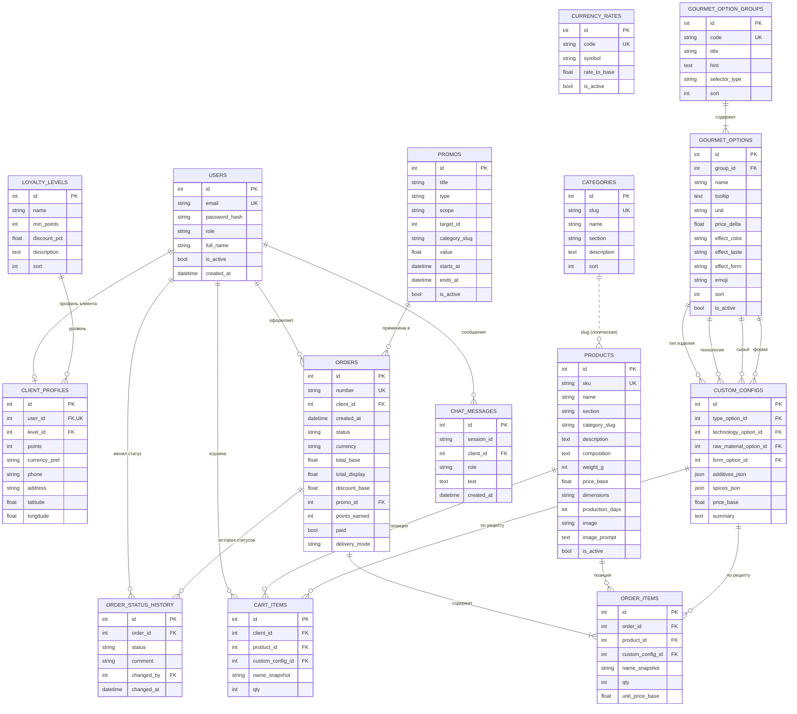

# Спецификация прототипа «Колбасный цех»

Документ описывает реализованный прототип интернет-магазина заказного производства мясокомбината:
назначение, роли, архитектуру, функциональные требования, бизнес-правила, модель данных и API.

Связанные документы: `README.md` (запуск), `docs/demo-accounts.md` (доступы),
`docs/product-prompts.md` (промпты изображений), `images/products/README.md` (правила изображений),
`demo/README.md` (автоматический демо-тур).

## 1. Назначение и границы

**Назначение.** Продающий прототип пользовательского интерфейса ПО для нового цеха мясокомбината,
работающего по двум направлениям:

1. **«Колбасные торты»** — художественные композиции из готовой продукции (разделы «Мясная лавка» и
   «Арт-объекты»).
2. **Изделия на заказ по рецепту клиента** — малые объёмы по выбранной технологии
   (конструктор «Для мясоедов-гурманов»).

**В границах прототипа.** Каталог, оформление заказа, демонстрационная оплата, личный кабинет и
лояльность, роли технолога/аналитика/администратора, аналитика и акции, ИИ-ассистент, авто-демонстрация.

**Вне границ (демонстрационные заглушки).** Реальные платежи и транзакции, автоматическая передача
заказов в производство, интеграция с логистикой и отслеживание доставки, реальный LLM (ассистент
скриптовый).

## 2. Роли и доступ

| Роль | Код | Возможности |
| --- | --- | --- |
| Клиент | `client` | каталог, конструктор, корзина, заказ, демо-оплата, кабинет, карта доставки, баллы |
| Технолог производства | `technologist` | справочники и цены конструктора, заказы, печать, выгрузка MD/JSON, статусы |
| Бизнес-аналитик | `analyst` | дашборды, управление акциями |
| Администратор сервиса | `admin` | пользователи и роли, клиенты, баллы |

Авторизация — JWT (HS256), пароли — PBKDF2-SHA256. Разграничение доступа — зависимости
`require_roles(...)` в `backend/app/security.py`. Администратор имеет доступ к разделам технолога и
аналитика.

## 3. Архитектура и стек

| Слой | Технологии |
| --- | --- |
| Backend | Python 3.12, FastAPI, SQLAlchemy 2, Pydantic v2, PyJWT |
| БД | SQLite (в Docker — том `/data/kolbaska.db`) |
| Frontend | React 18 + TypeScript + Vite, Tailwind CSS, React Router, Recharts |
| Карты | Leaflet + OpenStreetMap (подгружается с CDN) |
| Раздача | FastAPI отдаёт `/api/*` и собранный SPA (`static/`), SPA-fallback на `index.html` |
| Контейнер | Docker (multi-stage: node build → python runtime), docker-compose, порт `5010:8000` |
| Демо-тур | Playwright (Chromium) + Yandex SpeechKit TTS v3 + ffmpeg |

Поток запроса: SPA → `/api/*` (JWT в заголовке `Authorization: Bearer`) → FastAPI-роутер → SQLAlchemy →
SQLite. Статические изображения товаров и фоны отдаёт backend по SKU/имени.

## 4. Функциональные требования

### 4.1 Общие / публичные
- Главная: циклическая смена фонов (реальные изображения из `images/backgrounds` или встроенные
  градиенты), выбор валюты, блок акций, программа лояльности, переключение направлений.
- «О нас», «Контакты» (форма — демонстрационная).
- Регистрация и вход; быстрый вход под демо-роли.
- ИИ-ассистент «Роберт ИИчкин»: скриптовые ответы по каталогу, уровням, акциям, оплате, контактам;
  быстрые подсказки, кэш истории в БД.

### 4.2 Клиент
- Каталог «Для мясоедов-оригиналов»: вкладки «Мясная лавка» и «Арт-объекты», фильтр по категориям,
  поиск по названию/составу; в карточке — состав, вес, габариты, цена, срок производства.
- Карточка товара: количество, добавление в корзину; технологу/админу доступен промпт изображения.
- Конструктор «Для мясоедов-гурманов»: шаги — тип изделия, технология, сырьё, добавки, специи,
  форма; подсказки (влияние на цвет/вкус/форму), живой предпросмотр, автопересчёт цены, добавление
  конфигурации в корзину.
- Корзина: позиции обоих направлений, изменение количества, удаление, выбор способа получения,
  переход к оплате.
- Платёжная страница — демонстрационная; кнопка «Оплатить (демо)» переводит заказ в
  «Подтверждён» и начисляет баллы.
- Личный кабинет: уровень и баллы, прогресс до следующего уровня, скидка, профиль, история заказов,
  карта OpenStreetMap для указания места доставки (координаты сохраняются в профиле).

### 4.3 Технолог производства
- Справочники конструктора и цены: редактирование названий, подсказок, ед. измерения, надбавок,
  вкл/выкл позиции; изменения сразу влияют на расчёт цены.
- Заказы: фильтр по статусу, состав, печать (print-friendly), выгрузка в Markdown и JSON,
  смена статуса («Отправить в производство» — эмуляция), история статусов.

### 4.4 Бизнес-аналитик
- Дашборды: выручка по месяцам, топ ассортимента, заказы по дням недели, сезонность, эффект акций,
  сводные метрики (заказы, выручка, средний чек, продано позиций).
- Акции: CRUD скидок и множителей баллов (товар / категория / все товары), период действия,
  вкл/выкл; активные акции видны клиенту.

### 4.5 Администратор сервиса
- Пользователи: создание, смена роли, блокировка/разблокировка, сброс пароля.
- Клиенты: список, уровень и баллы, корректировка баллов (±), блокировка.

## 5. Бизнес-правила

**Ценообразование конструктора.**
`цена = BASE_PRICE + Σ price_delta(выбранных опций)`, где `BASE_PRICE` — базовая цена изделия
(`backend/app/content/gourmet.py`). Пересчёт — `POST /api/gourmet/price`.

**Скидки и акции.**
- Акция типа `discount`: процент на товар (`product`), категорию (`category`) или всё (`all`).
- Акция типа `points_multiplier`: множитель начисления баллов по тому же охвату.
- При checkout к позициям применяется лучшая подходящая скидка за период, затем скидка уровня
  лояльности на подытог.

**Лояльность.**
Баллы = `int(сумма_после_скидки / 100) × множитель_акции × бонус_уровня`. Уровни (порог, скидка):
«В начале славного пути» (0, 0 %), «Мясоед» (500, 3 %), «Заслуженный обжора» (2000, 6 %),
«Гуру мясной кулинарии» (5000, 10 %), «Повелитель колбас» (10000, 15 %). Уровень пересчитывается
при оплате и корректировке баллов администратором.

**Валюты.** Базовая — RUB; USD/EUR/CNY с фиксированным `rate_to_base`. Заказ хранит валюту и
`total_display`; интерфейс конвертирует по текущим курсам.

**Статусы заказа.**
`new → confirmed → in_production → packing → ready → shipped → done`, дополнительно `cancelled`.
Каждый переход фиксируется в истории статусов с автором и комментарием.

**Изображения товаров.** Имя файла = SKU (`MS-001`, `AO-001`, …). Backend отдаёт `.webp` при наличии,
иначе другой файл, иначе SVG-заглушку (`/api/catalog/image/{SKU}`, `/api/catalog/placeholder/{SKU}.svg`).

## 6. Модель данных

15 таблиц. Первичные ключи — `id`. `additives_json` / `spices_json` — JSON-массивы id опций
(ссылочная целостность на уровне приложения). `products.category_slug` связан с `categories.slug`
логически, без FK.

### 6.1 ER-диаграмма (Mermaid)



### 6.2 Назначение таблиц

| Таблица | Назначение |
| --- | --- |
| `users` | учётные записи всех ролей |
| `client_profiles` | профиль клиента: уровень, баллы, контакты, координаты доставки |
| `loyalty_levels` | уровни лояльности: порог, скидка, описание |
| `currency_rates` | курсы валют к базовой (RUB) |
| `categories` | категории внутри разделов |
| `products` | товары каталога (32 позиции) с метаданными и промптом изображения |
| `gourmet_option_groups` | группы конструктора (тип, технология, сырьё, форма, добавки, специи) |
| `gourmet_options` | варианты внутри групп с подсказками и надбавками |
| `custom_configs` | сохранённые конфигурации изделий по рецепту |
| `promos` | акции: скидки и множители баллов |
| `orders` | заказы: статус, суммы, скидка, баллы, валюта, получение |
| `order_items` | позиции заказа (товар каталога или конфигурация) |
| `order_status_history` | история переходов статусов |
| `cart_items` | корзина клиента |
| `chat_messages` | сообщения чата с ИИ-ассистентом |

### 6.3 Миграции

Схема создаётся `Base.metadata.create_all`. Для SQLite при старте выполняется лёгкая миграция
`ensure_schema()` (`backend/app/database.py`), добавляющая недостающие столбцы (например,
`client_profiles.latitude` / `longitude`) без потери данных.

## 7. API

Префикс — `/api`. Авторизация — `Authorization: Bearer <JWT>`. В скобках — требуемая роль.

### Auth
| Метод | Путь | Назначение |
| --- | --- | --- |
| POST | `/auth/register` | регистрация клиента |
| POST | `/auth/login` | вход, выдача JWT |
| GET | `/auth/me` | текущий пользователь, уровень, прогресс |
| PATCH | `/auth/me` | профиль, контакты, координаты, валюта |
| GET | `/auth/levels` | список уровней лояльности |

### Каталог и медиа
| Метод | Путь | Назначение |
| --- | --- | --- |
| GET | `/catalog/products` | каталог (`section`, `category`, `search`, `include_inactive`) |
| GET | `/catalog/products/{id}` | товар |
| POST/PUT | `/catalog/products[/{id}]` | создание/изменение (technologist, admin) |
| GET | `/catalog/categories` | категории (`section`) |
| GET | `/catalog/currency` | курсы валют |
| GET | `/catalog/backgrounds` | список фонов главной |
| GET | `/catalog/backgrounds/{filename}` | файл фона |
| GET | `/catalog/image/{filename}` | изображение товара (webp/др./SVG-заглушка) |
| GET | `/catalog/placeholder/{filename}` | синоним, совместимость с БД |

### Конструктор
| Метод | Путь | Назначение |
| --- | --- | --- |
| GET | `/gourmet/groups` | группы и опции с подсказками |
| POST | `/gourmet/price` | расчёт цены конфигурации |
| POST | `/gourmet/configs` | сохранение конфигурации |
| POST/PUT | `/gourmet/options[/{id}]` | управление опциями (technologist, admin) |

### Корзина
| Метод | Путь | Назначение |
| --- | --- | --- |
| GET | `/cart` | корзина клиента |
| POST | `/cart/items` | добавить товар/конфигурацию |
| PATCH | `/cart/items/{id}` | изменить количество |
| DELETE | `/cart/items/{id}` | удалить позицию |
| DELETE | `/cart` | очистить корзину |

### Заказы
| Метод | Путь | Назначение |
| --- | --- | --- |
| POST | `/orders/checkout` | оформление заказа из корзины |
| GET | `/orders` | список (клиент — свои; staff — все, фильтр `status`) |
| GET | `/orders/{id}` | заказ с позициями и историей |
| POST | `/orders/{id}/pay` | демо-оплата, начисление баллов |
| PATCH | `/orders/{id}/status` | смена статуса (technologist, admin) |
| GET | `/orders/{id}/export?format=md\|json` | выгрузка (technologist, admin) |

### Акции, аналитика, администрирование, ассистент
| Метод | Путь | Назначение |
| --- | --- | --- |
| GET | `/promos/public` | активные акции (публично) |
| GET/POST | `/promos` | список/создание (analyst, admin) |
| PUT/DELETE | `/promos/{id}` | изменение/удаление (analyst, admin) |
| GET | `/analytics/overview?days=` | метрики (analyst, admin) |
| GET/POST | `/admin/users` | пользователи (admin) |
| PATCH | `/admin/users/{id}` | роль, статус, пароль (admin) |
| GET | `/admin/clients` | клиенты (admin) |
| POST | `/admin/clients/{id}/points` | корректировка баллов (admin) |
| GET | `/assistant/quick-replies` | быстрые подсказки |
| POST | `/assistant/chat` | ответ ассистента |
| GET | `/assistant/history/{session_id}` | история чата |

### Служебные
| Метод | Путь | Назначение |
| --- | --- | --- |
| GET | `/api/health` | проверка работоспособности |
| GET | `/api/meta/statuses` | справочник статусов заказа |
| GET | `/docs` | Swagger UI |

## 8. Развёртывание и запуск

```bash
docker compose -f docker-compose.yml up -d --build   # http://localhost:5010
```

Контейнер отдаёт SPA и API, БД хранится в томе `kolbaska-data` (`/data/kolbaska.db`), каталог
`./images` монтируется в `/images` (товары и фоны). Локальная разработка — два dev-сервера
(uvicorn + vite), см. `README.md`.

## 9. Проверки

- Backend: `cd backend && .venv/bin/python -m pytest -q` — API, RBAC, цены, заказы, лояльность,
  акции, экспорт, миграции.
- Frontend: `npm run build` (tsc + vite), `npm run lint`.
- Демо-тур: `demo/.venv/bin/python demo/tour.py` и `demo/narrate.py` (озвученное видео).

## 10. Ограничения и допущения

- Ассистент скриптовый, без внешней LLM; ответы по заготовленным сценариям.
- Оплата и производство — эмуляция; реальных интеграций нет.
- Курсы валют статичны; мультиязычность отсутствует (только русский).
- Координаты доставки не влияют на расчёт стоимости/маршрут (только сохраняются).
- Раздача WebP-изображений и фонов рассчитана на браузер с доступом к сети (Leaflet/OSM, шрифты).
